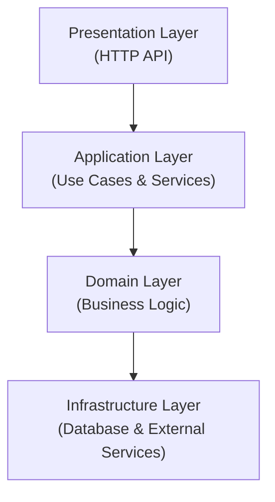

# ReMem - Language Learning Backend

A modern, production-ready language-learning MVP backend built with **Rust**, **Hexagonal Architecture**, and **Domain-Driven Design** principles.

## 🎯 Features

- **FSRS Integration** - Free Spaced Repetition Scheduler for optimal learning
- **AI-Based Answer Checking** - Intelligent assessment of user answers
- **REST API** - OpenAPI/Swagger documented endpoints
- **PostgreSQL** - Robust, reliable data persistence
- **Event-Driven Architecture** - Foundation for DDD migration
- **Docker & Kubernetes** - Container-ready deployment
- **Test-Driven Development** - Comprehensive test coverage
- **SOLID Principles** - Clean, maintainable code

## 🏗️ Architecture

The project follows **Hexagonal Architecture** (Ports & Adapters) with clear separation of concerns:



For detailed architecture documentation, see [docs/ARCHITECTURE.md](docs/ARCHITECTURE.md).

## 🚀 Quick Start

### Prerequisites

- Rust 1.70+
- PostgreSQL 13+
- Docker & Docker Compose (optional)

### Development Setup

```bash
# Clone repository
git clone <repo> && cd re-mem

# Copy environment file
cp .env.example .env

# Start PostgreSQL
docker-compose up postgres

# Build project
cargo build

# Run migrations
cargo sqlx migrate run

# Start development server
cargo run
```

The API will be available at `http://localhost:3000`

Health check: `curl http://localhost:3000/health`

For detailed setup instructions, see [docs/DEVELOPMENT.md](docs/DEVELOPMENT.md).

## 📚 Documentation

- **[AGENTS.md](AGENTS.md)** - Comprehensive guide for AI agents working on this project
- **[docs/ARCHITECTURE.md](docs/ARCHITECTURE.md)** - Project architecture and design decisions
- **[docs/API.md](docs/API.md)** - REST API endpoints and usage
- **[docs/DATABASE.md](docs/DATABASE.md)** - Database schema and migrations
- **[docs/DEVELOPMENT.md](docs/DEVELOPMENT.md)** - Development setup and workflow

## 🔧 Project Structure

```bash
src/
├── domain/              # Core business logic (entities, repositories)
├── application/         # Use cases and application services
├── infrastructure/      # Database and external service implementations
├── presentation/        # REST API handlers and routing
└── shared/              # Event bus, error handling, utilities

docs/
├── ARCHITECTURE.md      # Hexagonal architecture details
├── API.md              # REST API documentation
├── DATABASE.md         # Database schema and migrations
└── DEVELOPMENT.md      # Development guide

k8s/
└── deployment.yml      # Kubernetes manifests

.docker/
└── Dockerfile          # Container configuration

tests/
└── integration_tests.rs # Integration tests
```

## 💻 Development

### Running the Project

```bash
# Development with live reload
cargo watch -x run

# Production build
cargo build --release

# Run tests
cargo test

# Format and lint
cargo fmt && cargo clippy
```

### API Testing

```bash
# Health check
curl http://localhost:3000/health

# Create user
curl -X POST http://localhost:3000/users \
  -H "Content-Type: application/json" \
  -d '{"email": "user@example.com", "name": "John Doe"}'
```

See [docs/API.md](docs/API.md) for full endpoint documentation.

## 🐳 Docker & Kubernetes

### Docker Compose (Development)

```bash
docker-compose up
```

### Kubernetes Deployment

```bash
# Build image
docker build -t re-mem:latest -f .docker/Dockerfile .

# Deploy to cluster
kubectl apply -f k8s/

# Check status
kubectl get pods -n re-mem
```

## 🧪 Testing

```bash
# Run all tests
cargo test

# Run specific test
cargo test --lib domain::value_objects

# Run with output
cargo test -- --nocapture --test-threads=1

# Integration tests
cargo test --test '*'
```

## 📦 Dependencies

### Core

- **Tokio** - Async runtime
- **Axum** - Web framework
- **SQLx** - Type-safe database access
- **PostgreSQL** - Database driver

### Domain

- **UUID** - Unique identifiers
- **Chrono** - DateTime handling
- **Serde** - Serialization/deserialization

### FSRS

- **fsrs-rs** - Spaced repetition scheduling

### Other

- **Thiserror** - Error handling
- **Tracing** - Logging and observability
- **Dotenv** - Environment configuration

See [Cargo.toml](Cargo.toml) for full list.

## 🎓 SOLID Principles

This project strictly follows SOLID design principles:

- **S**ingle Responsibility - Each module has one reason to change
- **O**pen/Closed - Open for extension, closed for modification
- **L**iskov Substitution - Implementers are substitutable
- **I**nterface Segregation - Narrow, focused interfaces
- **D**ependency Inversion - Depend on abstractions, not concrete types

## 🛣️ Roadmap

### MVP (Current)

- ✅ Basic user management
- ✅ Card (flashcard) CRUD
- ✅ Review submission
- ✅ Hexagonal architecture
- ✅ Docker/Kubernetes setup

### Phase 2 (Near Future)

- [ ] FSRS algorithm integration
- [ ] AI-based answer checking
- [ ] Authentication (JWT)
- [ ] Authorization (RBAC)
- [ ] OpenAPI documentation
- [ ] Event persistence

### Phase 3 (DDD Migration)

- [ ] Event sourcing
- [ ] CQRS pattern
- [ ] Domain events
- [ ] Aggregates
- [ ] Value objects migration

### Future

- [ ] Multi-tenancy support
- [ ] Real-time WebSocket updates
- [ ] Advanced analytics
- [ ] Mobile app backend
- [ ] Microservices decomposition

## 🤝 Contributing

Contributions are welcome! Please see [CONTRIBUTING.md](CONTRIBUTING.md) for guidelines.

## 📝 Code of Conduct

Please be respectful and professional. See [CODE_OF_CONDUCT.md](CODE_OF_CONDUCT.md).

## 📄 License

[Specify your license here - MIT, Apache 2.0, etc.]

## 👥 Authors

- Development Team at ReMem

## 🙏 Acknowledgments

- FSRS algorithm by [SuperMemory](https://supermemo.wiki/)
- Hexagonal Architecture by Alistair Cockburn
- Domain-Driven Design by Eric Evans

## 📧 Contact

For questions or issues, please open a GitHub issue or contact the team.

---

Built with Rust | Hexagonal Architecture | DDD Principles

**Current Status**: MVP Foundation Ready  
**Last Updated**: February 2026  
**Rust Version**: 1.70+
